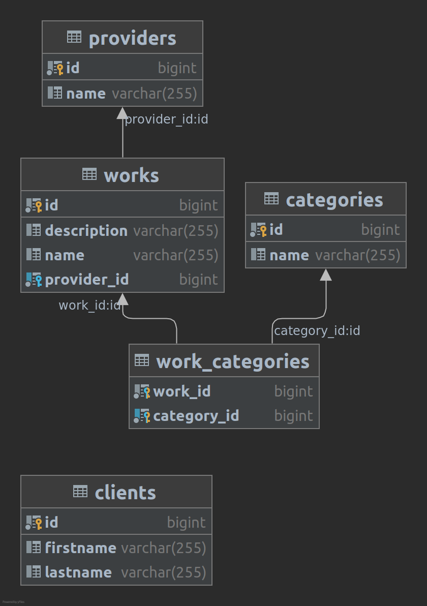

# business-api

[](https://circleci.com/gh/mikeacosta/business-api/tree/main)

<p align="center">
    
</p>

---

<p align="center">
    <br />
    
</p>

---

## MySQL Docker Container

1. Run this command from this repo's root directory (where the `docker-compose.yml` file is).  This will start the container.  The `-d` option will leave it running in the background.

```
$ docker-compose up -d
```

2. Run `docker ps` to confirm the container is running.

```
$ docker ps
CONTAINER ID   IMAGE     COMMAND                  CREATED          STATUS          PORTS                                                  NAMES
be214cc27155   mysql     "docker-entrypoint.s…"   30 minutes ago   Up 17 seconds   33060/tcp, 0.0.0.0:3307->3306/tcp, :::3307->3306/tcp   business-api_db_1
```

3. Access the running container `business-api_db_1`.  The `-it` flag accesses the container in an interactive mode.

```
$ docker exec -it business-api_db_1 bash 
```

4. At the bash prompt from inside the container, run file `mysql.sql` on MySQL server, entering the password defined in `docker-compose.yml` when prompted.

```
# mysql -u root -p dev_db > mysql.sql
Enter password: 
```

5. Connect to MySQL server.

```
# mysql -u root -p dev_db
Enter password:
Welcome to the MySQL monitor.  Commands end with ; or \g.

...

mysql>
```

6. Run various [MySQL commands](https://phoenixnap.com/kb/mysql-commands-cheat-sheet).
```
mysql> SHOW DATABASES;
+--------------------+
| Database           |
+--------------------+
| dev_db             |
| information_schema |
| mysql              |
| performance_schema |
| sys                |
+--------------------+
5 rows in set (0.00 sec)

mysql> exit
Bye
```

7. Exit the container.
```
# exit
```

8. Stop and remove the running container.
```
$ docker-compose down
```